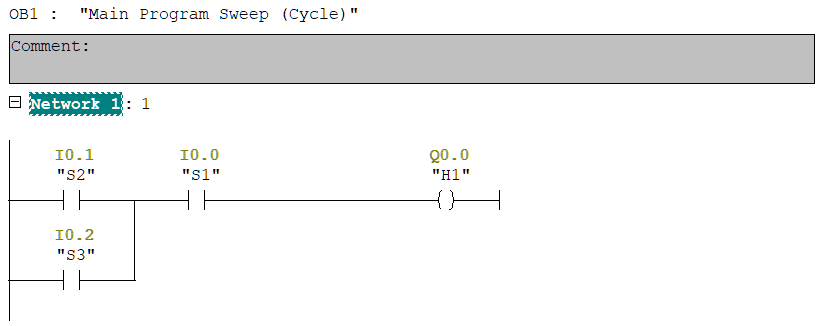

## Description

ASP.NET interface for SIMATIC Manager v5.7 program.

The lamp (H1) is active when S1 switch is active and one of S2 or S3 switches is active.

## LAD Program

S7-PLCSIM project files included in the /project/ folder.

## Example video

https://www.youtube.com/watch?v=IW8OWaEb-oE